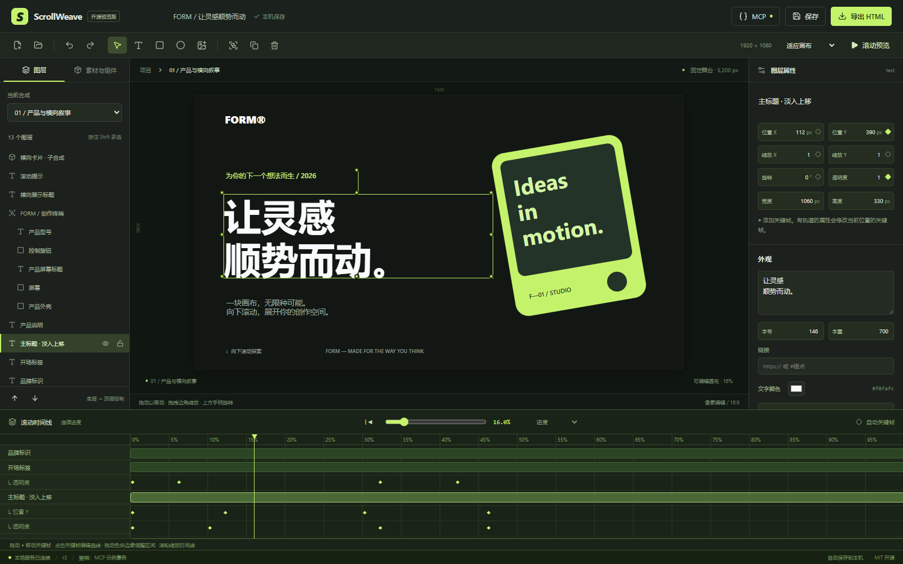

# ScrollWeave · 滚动驱动 Web 动效编辑器

面向 Web coder 与 coding agent 的本地动画工作台。通过图层、画布、关键帧和连续进度制作滚动网页，导出为可以双击打开的单文件 HTML。中文界面；MIT 开源；不需要账号、付费服务或模型 API Key。



## 启动

需要 Node.js **22.12+** 和 npm。在项目根目录运行：

```sh
npm ci
npm run dev
```

打开 **http://127.0.0.1:4100**。首次启动自动加载完整 FORM 示例。

```sh
npm run typecheck
npm test
npm run test:e2e
npm run build
npm start
```

`npm start` 使用生产构建，启动前请停止同一工作区的开发服务。不要同时启动两份服务修改同一个工作区；服务会通过进程锁阻止这种情况。默认仅监听 `127.0.0.1`。

截图工具和浏览器测试需要 Chromium。Windows 自动检测本机 Chrome / Edge；其他环境先运行：

```sh
npx playwright install chromium
# Linux 缺系统库时：npx playwright install --with-deps chromium
```

也可设置 `SW_BROWSER_PATH` 为 Chromium 可执行文件路径。`PORT` 可更改服务端口；`SW_WORKSPACE` 可指定另一个项目工作区。所有命令均从本项目根目录执行。

## 完整编辑流程

1. 打开示例，拖动底部播放头观察画面。画布是 1920×1080 设计坐标，页面长度由滚动区间决定。
2. 点击图层或画布，使用 Moveable 手柄拖动、调整尺寸和旋转。属性面板使用设计像素；缩放与透明度使用倍率。
3. 移动播放头，在属性旁点击 **◆** 添加关键帧。已有轨道的属性在当前进度写入关键帧；启用“自动关键帧”可对未建轨道的属性使用同样操作。
4. 时间线上拖动色块移动素材，拖动边缘裁剪，原有动画速度保持不变。点击关键帧可编辑数值、位置、预设缓动与贝塞尔曲线；调整曲线后点击“应用曲线”。新文字、图片、形状与预制从播放头插入，默认占 20% 进度（靠近结尾时向前放置）。
5. Shift 多选同级图层，点击分组。双击子合成图层进入编辑，使用“当前合成”选择框返回。一个合成可被多次实例化。
6. “素材与组件”提供三种可编辑预制、图片导入、子项目导入和子合成保存。预制应用到现有图层时替换对应的动画通道，其余属性保留。
7. 空白处取消选择，在右侧配置滚动距离、固定舞台/纵向内容、精确跟随/平滑追随及整体缩放/裁切。
8. 打开“滚动预览”，用原生滚动条、触控板、滚轮或 PageDown/PageUp 操作。舞台固定时内部卡片向左移动；完成后舞台随页面离开，行动按钮进入纵向内容流。
9. “保存”下载完整 `.scrollweave.json` 包；“打开”恢复；“导出 HTML”生成素材和运行时代码内嵌的单个文件。

时间线默认精简显示：只展开当前图层的关键帧，分组子层可以折叠；全程静态的品牌、水印和背景集中到“全程静态图层”。淡出到零之后的空白不再占用色块，原始关键帧保留。点击“全部轨道”可查看所有内容。不能从动画自动推断每个静态品牌应该何时消失；已有项目的内容和可见性保持原样，需要结束时可按 W 裁右。

| 操作                                 | 快捷键                         |
| ------------------------------------ | ------------------------------ |
| 上下浏览轨道 / 横向移动 / 缩放       | 滚轮 / Shift+滚轮 / Ctrl+滚轮  |
| 分割选中素材 / 裁掉播放头左侧 / 右侧 | Ctrl+B / Q / W                 |
| 复制、粘贴关键帧到播放头             | Ctrl+C / Ctrl+V                |
| 多选关键帧                           | Shift 或 Ctrl+点击 ◆           |
| 删除所选关键帧；未选关键帧时删除图层 | Delete / Backspace             |
| 微调所选关键帧或播放头 0.1% / 1%     | ← → / Shift+← →                |
| 跳到相邻关键帧                       | Alt+← →                        |
| 播放 / 暂停预览，跳到首尾            | Space / Home / End             |
| 放大、缩小、显示完整时间线           | + / - / Shift+Z                |
| 切换吸附                             | N                              |
| 撤销 / 重做 / 保存                   | Ctrl+Z / Ctrl+Shift+Z / Ctrl+S |
| 复制图层；选中关键帧时复制到后方 1%  | Ctrl+D                         |

输入框内保留文字编辑快捷键。Mac 的编辑快捷键使用 Command（滚轮缩放仍使用 Ctrl）。Q/W 不做波纹删除，不会改变后续章节的滚动位置；分割和裁剪也可从底栏点击。粘贴关键帧保留相对间距，目标同位置已有关键帧时替换；拖动或微调发生碰撞时明确报错。Space 的预览速度是 12 秒走完整段，仅用于编辑预览，不改变滚动动画或项目格式。

## 人与 Agent 共用项目

真正的 MCP 接入点是 `http://127.0.0.1:4100/mcp`，使用 Streamable HTTP。也提供 stdio 桥接，桥接只调用现有服务，不复制状态。连接配置、工具说明及可执行调用示例见 [docs/MCP.md](docs/MCP.md)。

所有项目修改共用 `ProjectStore → applyCommands → validateProject`，批量修改原子提交、一次撤销。修改必须携带 `expectedRevision`；冲突会返回 `REVISION_CONFLICT`，不会覆盖新的修改。SSE 将人和 Agent 的操作推送给界面。

工作区自动保存到 `.scrollweave/workspace.json`，导出的文件同时保存在 `.scrollweave/exports/`。项目包中的图片使用 data URL，不包含原作者机器的路径。撤销历史保留最近 80 次事务，仅在当前服务进程内有效；重启恢复项目与修订号，不恢复撤销栈。

## 示例与文档

- [可编辑示例项目](examples/form.scrollweave.json)
- [独立示例 HTML](examples/form.html)：直接用浏览器打开即可，不需要服务
- [技术选型与简短实施规划](docs/RESEARCH.md)
- [数据格式、进度与渲染架构](docs/ARCHITECTURE.md)
- [MCP 配置与调用](docs/MCP.md)
- [社区预制、元素与导出适配接口](docs/EXTENSIONS.md)
- [验收记录及限制](docs/ACCEPTANCE.md)
- [贡献指南](CONTRIBUTING.md)
- [第三方声明](THIRD_PARTY_NOTICES.md)

## 首版范围

支持文字、静态 PNG/JPEG/WebP、矩形/圆形、分组、边缘裁切、图层排序、嵌套合成、位置/缩放/旋转/透明度关键帧和三种预制。编辑画布与页面导出复用同一 `mountStage` 和 Motion 插值逻辑。精确模式可随机寻址；平滑模式由视口持有实际进度并追赶目标，子合成本身没有共享播放状态。

首版以桌面 Chromium 为验收环境，界面最小宽度 1060px；导出页面支持整体等比缩放或居中裁切，不做自动移动重排。采用系统字体，跨系统文字排版可能有差别。单张图片限制 10MB，HTTP 项目请求限制 60MB。静态图片以外的媒体、SVG/任意 HTML 导入、路径蒙版、3D、骨骼、账号、云协作、插件市场和 Astro 导出不在本版范围内。

源码见 [LICENSE](LICENSE)。示例素材均由项目中的文字和基础形状构成，不依赖外部媒体。
