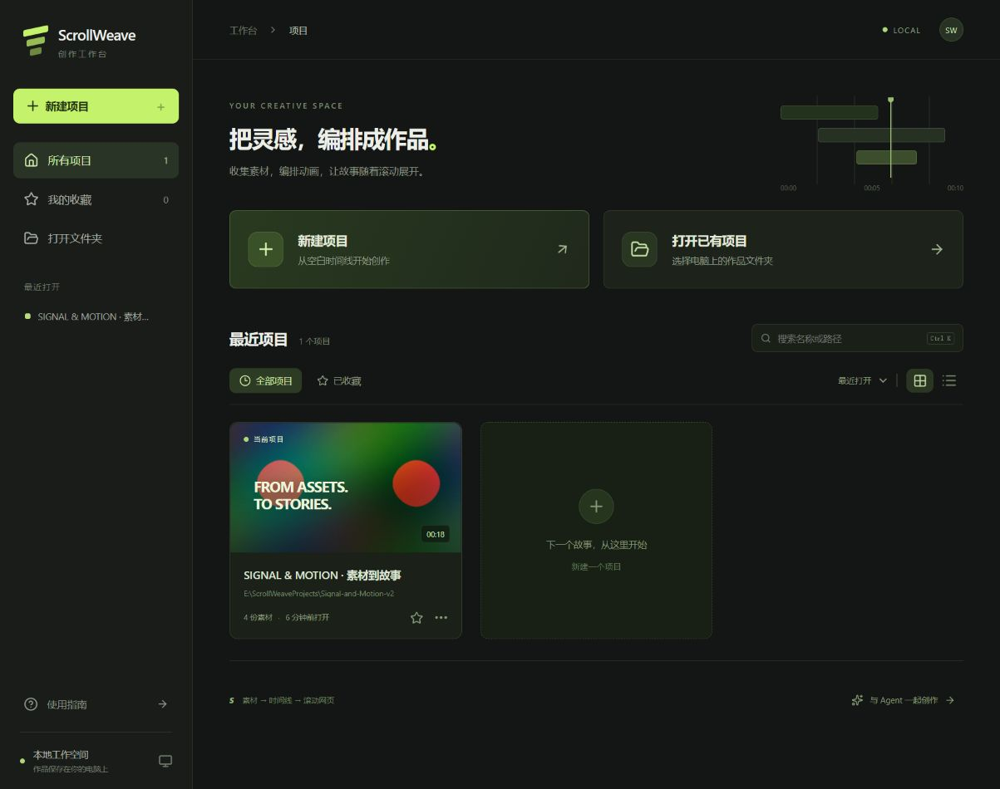

# ScrollWeave 0.2 · 从素材到滚动作品

本地、以素材为中心的滚动网页编辑器。图片、SVG、视频先进入素材库，再成为时间线上的独立片段；用秒编排，用播放检查，再把同一条时间线映射为网页滚动。无需账号或模型 API Key。



## 启动

需要 Node.js 22.12+、npm，以及位于 PATH 的 **FFmpeg 和 FFprobe**。媒体探测、真实缩略帧由本机 FFmpeg 处理；项目不捆绑其二进制。本轮环境实测 Node 26.5、FFmpeg 8.1.2、Windows Chrome。

```sh
npm ci
npm run dev
```

Windows 可使用 `npm run dev:background` 在后台启动本地服务，关闭启动终端后仍可编辑。重复运行会复用已启动的服务；日志保存在源码目录 `.scrollweave/dev-server-*.log`。页面断线会自动重连并重新同步作品。

打开 http://127.0.0.1:4100，首先进入**项目管理主页**。新建项目只需填写名称；“打开已有项目”和“更改保存位置”会调用系统文件夹选择器。点击项目卡片进入剪辑工作区，左上角返回主页。

Windows 使用系统原生文件夹对话框；Linux 使用桌面环境的 Zenity 或 KDialog。没有可用桌面选择器时可输入完整目录路径。选择器在运行 ScrollWeave 本地服务的电脑上打开，直接连接原文件夹。

主页支持最近项目、收藏、名称/路径搜索、排序、网格/列表视图、重命名和移出列表。项目卡片读取真实素材缩略图、时长和素材数量。**移出列表保留项目文件和素材**，以后可以重新打开。未登记的目录不会自动扫描加入列表。

默认新项目保存在源码目录旁边的 `ScrollWeaveProjects` 下，**不是源码目录**。新建窗口可更改保存位置。项目记录保存在用户目录的 `.scrollweave/projects.json`；`SW_PROJECTS_DIR`、`SW_LIBRARY_PATH` 可分别覆盖默认作品父目录和列表文件。未指定 `SW_WORKSPACE` 时，服务恢复最近一个可读取的项目；无历史记录时准备 `ScrollWeaveProjects/My-first-work` 空作品。主页仍是默认入口。

剪辑工作区地址为 `/editor`，与 MCP 共用当前活动项目。已有顶部“作品”入口继续支持打开项目包或旧版 JSON。主页的设计参考、行为与验收见 [项目主页说明](docs/PROJECT-HOME.md)。

指定作品目录（PowerShell）：

```powershell
$env:SW_WORKSPACE='E:\ScrollWeaveProjects\My-work'
$env:PORT='4100'
npm run dev
```

生产构建：`npm run build`，然后 `npm start`。先停止使用同一作品目录的旧服务；进程锁阻止同目录双写。服务只监听本机，拒绝非本机 Host 和跨站 Origin。

`SW_FFMPEG`、`SW_FFPROBE` 可指定可执行文件。截图与验收自动检测 Windows Chrome/Edge，也可设置 `SW_BROWSER_PATH`；其他环境可安装 Playwright Chromium。

## 素材 → 片段 → 时间线

1. **导入素材**：批量选择或拖到素材库，仅入库。点击卡片打开独立源预览，不改变作品或播放头；PNG/JPEG/WebP、SVG、MP4/WebM 有类型、尺寸、缩略图，视频显示真实时长。
2. **放入时间线**：将卡片拖到指定轨道和秒数。同一素材可反复使用。卡片的 + 放到播放头，碰撞时找空轨或创建新轨。直接拖文件到轨道明确执行“导入并创建片段”。
3. **剪辑**：拖动色块移动，拖左右边缘裁剪，Shift 多选，Ctrl+B 分割。静态片段默认 5 秒；视频默认真实时长。后续内容自动延长编排，已有动画不会被压缩。
4. **动画**：单选片段 → 按 K（或“添加位置关键帧”）→ 移动播放头 → 拖动画布素材，自动记录下一组 X/Y 关键帧。菱形叠在素材条顶部，随片段移动、裁剪和缩放；点击菱形或两帧间曲线在右侧编辑。`[` / `]` 跳转前后帧，Shift+K 开关自动记录（首次在中途编辑会保留初始姿态）。其他属性也可通过旁边的 ◇ 开启动画。支持六种缓动预设、贝塞尔控制点和数学公式，例如 `t*t*(3-2*t)`；t 为两帧之间 0–1 的时间进度，要求 f(0)=0、f(1)=1。公式、编辑预览和导出网页使用相同求值器。
5. **复合片段**：选择多个顶层片段，Alt+G。双击进入内部，左上返回。素材库中可重复使用；内部内容默认共享，属性面板可“将此实例变为独立副本”。源素材预览有独立的静音播放头。
6. **检查**：剪辑预览按真实时长播放，视频播放自己的源进度，同时应用位移/缩放等动画。片段有音量和静音。滚动预览始终静音，支持向前、向后和跳转定位。
7. **滚动编排**：左侧独立页签选择时间线、起止秒数、滚动距离和固定/纵向经过。修改距离不会改剪辑或关键帧。横向展示用 X 位置动画；可组合纵向进入、固定舞台和继续纵向。精确跟随与平滑追随共用同一求值器。
8. **交付**：自动保存完整结构；“保存项目包”生成可迁移 ZIP。“导出网页”对图片/SVG生成单 HTML，含视频生成 **HTML + assets ZIP**。解压后一起交付，不依赖编辑器。

删除时间线片段不删除源文件。素材预览会显示所有引用；使用中的素材不能直接移出库。重新关联保留素材 ID，影响所有引用，保留已有剪辑、位置与关键帧。可选“片段结构”便于检查旧版分组及内部节点，默认不占主要创作入口。

## 清楚的编辑规则

| 操作                 | 行为                                                                 |
| -------------------- | -------------------------------------------------------------------- |
| 放入空位 / 普通移动  | 同轨碰撞明确报错，不挪动其他片段                                     |
| 插入并后移           | 在落点分割穿过的片段，将同轨后续内容后移                             |
| 覆盖片段             | 只裁掉被覆盖的同轨区间，保留两侧源进度                               |
| 普通删除             | 留空                                                                 |
| 波纹删除             | 删除并收拢对应轨道；“跨轨联动”开启时作用于其他轨道                   |
| 跨轨波纹穿过未选片段 | 明确拒绝，先分割或一起选中                                           |
| 吸附                 | 对齐播放头及片段边界，阈值约 9 屏幕像素；不代表主轨磁吸或自动联动    |
| 裁边 / 分割          | 保留源时钟与关键帧；后段不从素材开头重播                             |
| 变速                 | 明确改变持续时间与动画速度，保持源取用范围                           |
| 多选                 | 移动、复制、删除、分割、复合片段作用于全部选中；多选画布变换明确禁用 |

同一轨道可连续放入多个素材；导入素材的 +、新建文字/形状和单轨片段粘贴会优先复用现有轨道的空位。时间线左侧仅保留窄序号栏，悬停或键盘聚焦可锁定、隐藏或删除空轨道。轨道由下到上叠放。所有人/Agent修改经过相同事务、校验和 revision 冲突检测。撤销最近 80 次事务；重启恢复结构、revision、选择和预览，不恢复撤销栈。

| 快捷键                 | 操作                                  |
| ---------------------- | ------------------------------------- |
| Space                  | 播放 / 暂停                           |
| Ctrl / Command + B     | 播放头处分割全部选中片段              |
| Ctrl / Command + C / V | 复制 / 在播放头粘贴，优先复用空位     |
| Shift 点击 / Ctrl+A    | 多选 / 全选顶层片段                   |
| Delete / Shift+Delete  | 普通 / 波纹删除；选中关键帧时删除该帧 |
| Alt+G                  | 创建复合片段                          |
| Ctrl+Z / Ctrl+Shift+Z  | 撤销 / 重做                           |
| ← / →，Shift+← / →     | 定位一帧（1/30秒）/ 一秒              |
| 时间线缩放控件、滚动条 | 缩放刻度、纵向和横向浏览              |

输入框保留文字编辑快捷键。旧版百分比快捷键 Q/W 等不再作为本版承诺。

## 与 Agent 共用作品文件夹

```text
My-work/
  AGENTS.md                    Agent 素材与编辑约定
  SCROLLWEAVE.md               服务更新的实际连接地址
  .mcp.json                    通用 HTTP MCP 配置示例
  project.scrollweave.json     可编辑项目与会话
  assets/                     人与 Agent 共用的原始素材入口
  .scrollweave/media/          清理后的媒体与缩略图缓存
  .scrollweave/backups/        导入前快照与原始输入
  exports/                    项目包、网页交付
```

在作品目录打开 Codex，让它先写 `assets/icon.svg.tmp`，完成后重命名为 `assets/icon.svg`。监听只扫描 assets；约 900ms 写入稳定后入库，忽略临时/隐藏文件，按路径与内容 hash 去重。新 SVG 自动显示缩略图；更新同路径会刷新全部引用，删除/移动显示缺失，可重新关联。

**外部文件不属于时间线撤销**：撤销编辑不会覆盖 Agent 新写的内容。无效 SVG 会标记错误，已有有效缓存和片段仍保留；恢复文件后自动恢复。缓存按内容版本保存，当前没有自动回收策略。

MCP 使用本机 Streamable HTTP，默认 http://127.0.0.1:4100/mcp。目录内有配置不等于已经连接；本轮通过 SDK 建立连接、读取工具并完成实际编辑和截图。接入与调用见 [MCP 说明](docs/MCP.md)。

## 新示例与验收

- [SIGNAL & MOTION 可编辑作品包](examples/signal-and-motion/signal-and-motion.scrollweave.zip)
- [SIGNAL & MOTION 网页包（含视频）](examples/signal-and-motion/signal-and-motion.html.zip)
- [从空作品生成的过程记录](examples/signal-and-motion/acceptance.json)
- [剪映 Computer Use 实测记录](docs/COMPUTER-USE.md)，含版本、操作与截图，也标明未能可靠验证的操作
- [验收记录、编码范围和限制](docs/ACCEPTANCE.md)
- [数据模型、迁移和架构](docs/ARCHITECTURE.md)

示例使用自行生成的图片、8 秒 H.264/AAC 视频和 SVG。运行 `npm run example` 可通过真实 MCP 在**当前空作品**重建；已有内容时拒绝覆盖。保留 `examples/form.scrollweave.json` 原版作为 v1 回归样本，不作为新默认示例。

```sh
npm run typecheck
npm test
npm run test:e2e
npm run licenses
npm run build
```

本版主要面向桌面 Chromium，编辑器最小宽度 1080px。媒体支持边界、SVG 清理规则、浏览器 seek 延迟、音频与复杂剪辑限制见验收文档。源码 [MIT](LICENSE)；[第三方声明](THIRD_PARTY_NOTICES.md)。
